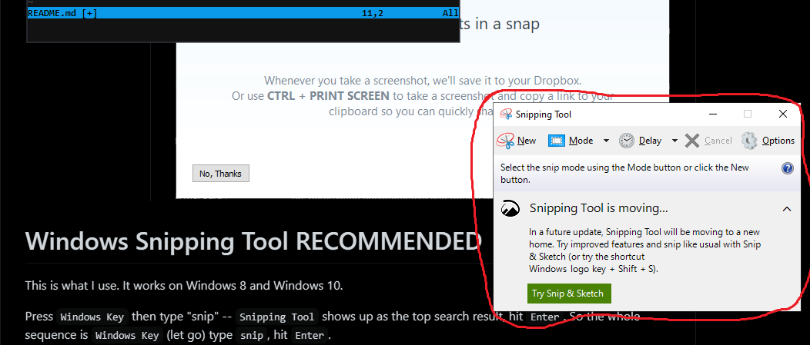

Table of Contents:

- [PrtSc (not recommended)](README.md#press-the-printscreen-button)
- [Snip & Sketch (Windows 10)](README.md#windows-snip-n-sketch)
- [Snipping Tool (Windows 8 and 10)](README.md#windows-snipping-tool)

# Press the PrintScreen button

Press the `PrtSc` button.

Depending on what's installed, different things happen. On my
computer, I got this:

I hit `No, Thanks` and I don't see this message again.

There is no visual indication that `PrtSc` did anything, but the
whole screen **is now in the clipboard**.

Open paint (hit `Windows key`, type `paint`, hit `Enter`), then
`Ctrl+V` to paste, then save.

I never use this: it's too many steps and I never want the whole
screen.

# Windows Snip-n-Sketch

This is Windows 10 only. Windows really wants you to use this
one.

Press `Windows Key + Shift + S`, and you get this overlay:

The default mode is to drag a rectangular region. After the drag,
the image opens in `Snip & Sketch` for editing/saving.

In addition to dragging a region:

- set the mode to **snip an entire window**
    - this is useful if taking a lot of screenshots and you want
      them all to be the same size (like a bunch of plots -- just
      don't resize the window)
- or set the mode to **snip the whole screen** to do what `PrtSc` does

# Windows Snipping Tool

This is identical to `Snip & Sketch` but it also works on Windows
8.

- press `Windows Key`
- type "snip"
    - `Snipping Tool` shows up as the top search result
- hit `Enter`.

So the whole sequence is `Windows Key` (let go) type `snip`, hit
`Enter`.

It's identical to `Snip & Sketch`, but the UI is a *normal*
**Windows** window instead of a transparent overlay:

- *normal window* means it has the usual **Alt-key** menu shortcuts
    - in this case, `Alt-n` for *New*, `Alt-m` to change *Mode*
